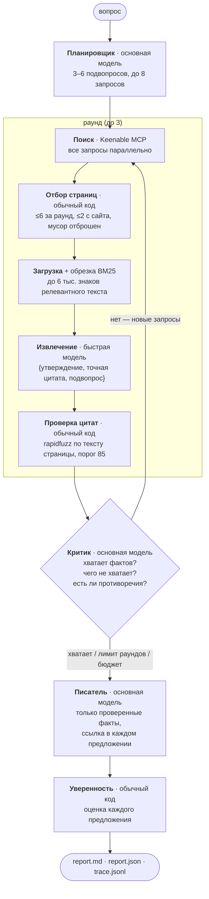

# TARO — Talisman Agent for Research and Observation

Агент глубокого исследования. Принимает вопрос, ищет в интернете, извлекает из найденных страниц
факты **с точными цитатами**, проверяет каждую цитату по тексту страницы и пишет ответ, где **у
каждого предложения есть ссылки на источники и своя оценка уверенности**.

Главное правило: ответ должен следовать из прочитанных страниц, а не из памяти модели. Если фактов
не нашлось — агент обязан это сказать, а не досочинить.

```
$ python -m taro "Какой клуб выиграл Кубок Гагарина в 2026 году и кого он обыграл в финале?"

Клуб «Локомотив» из Ярославля стал обладателем Кубка Гагарина в 2026 году [1][2][3]. 🟢
В финальной серии «Локомотив» обыграл казанский клуб «Ак Барс» [1][2]. 🟡
... Один источник сообщает, что финальный матч завершился со счётом 4‑1 [3], тогда как
другие указывают общий счёт серии 4‑2 [2][4][5]. 🟢

confidence 0.78 🟢 — 5 of 5 sentences cite a source; 4 different sites cited
```

Готовые примеры со ссылками и цитатами — в [`examples/`](examples/README.md).
Как всё устроено, что измерялось и что из этого вышло — в [`REPORT.md`](REPORT.md).

## Что внутри

Три версии агента, которые можно запускать и сравнивать между собой — это и есть эксперимент, а не
просто «черновики»:

| режим | что делает | когда полезен |
|---|---|---|
| **v1** | один вызов модели, никакого поиска | базовая линия: что модель знает сама. Уверенность всегда 0.00 🔴 |
| **v2** | один поиск по исходному вопросу → 8 сниппетов → один вызов модели | простой RAG. Дёшево (5 с, ~3 тыс. токенов) и уже закрывает вопросы про свежие события |
| **v3** | планировщик → раунды (поиск → выбор страниц → чтение → извлечение фактов с цитатами) → критик → писатель | многошаговые вопросы; режим по умолчанию |

Измерено на 28 вопросах (подробности и таблицы — в [`eval/results/results.md`](eval/results/results.md)):

| | верных ответов | цитаты подтверждены | средняя уверенность | с/прогон | токенов/прогон |
|---|---|---|---|---|---|
| v1 | 57 % | — (никогда не цитирует) | 0.00 | 2 | 409 |
| v2 | 79 % | 61 % | 0.47 | 5 | 3 186 |
| v3 | **89 %** | **74 %** | 0.53 | 57 | 25 858 |

На 8 вопросах о событиях 2026 года: **v1 — 0 из 8, v2 и v3 — 8 из 8.** Ни v2, ни v3 ничего не
выдумали на вопросах с ложной предпосылкой; v1 «закрыл» существующий институт и придумал двух
лауреатов премии Абеля.

## Установка

Нужен Python 3.12 (Node — только если вы собираетесь менять веб-интерфейс, собранная страница лежит
в репозитории).

```bash
git clone <repo> && cd Dzimas_task
python -m venv .venv
.venv\Scripts\activate          # Linux/macOS: source .venv/bin/activate
pip install -r requirements.txt
copy .env.example .env          # Linux/macOS: cp .env.example .env
```

Дальше откройте `.env` и впишите два ключа:

```ini
KEENABLE_API_KEY=...    # веб-поиск (MCP-сервер Keenable)
LITELLM_API_KEY=...     # LLM-сервис ИСП РАН (https://litellm.ispras.ru/)
```

Модели уже выбраны в `.env.example` и менять их не нужно: `openai/gpt-oss-120b` — основная (планирует,
критикует, пишет), `google/gemma4:31b` — быстрая (читает страницы). Почему именно эти — в
[`REPORT.md`](REPORT.md#выбор-моделей).

Проверка, что всё собралось:

```bash
pytest                          # 93 теста, ~6 с, интернет не нужен
python scripts/smoke_test.py    # 1 вызов модели + 1 поиск + 1 загрузка страницы — нужны ключи
```

## Запуск

```bash
# один вопрос (режим по умолчанию — v3)
python -m taro "Кто стал директором ИСП РАН после Иванникова и в каком году?"

# сравнить режимы на одном вопросе
python -m taro "Who won the Nobel Prize in Physics in 2025 and for what?" --mode v1
python -m taro "Who won the Nobel Prize in Physics in 2025 and for what?" --mode v2
python -m taro "Who won the Nobel Prize in Physics in 2025 and for what?" --mode v3

python -m taro "вопрос" --no-cache    # не использовать кэш поиска и страниц
```

Каждый прогон пишется в `runs/<ГГГГММДД-ЧЧММСС>-<режим>/`:

- `report.md` — отчёт для чтения (ответ, уверенность, источники с цитатами, статистика),
- `report.json` — то же машинно-читаемо: предложения, их ссылки и оценки,
- `trace.jsonl` — полный журнал шагов: каждый вызов модели, каждый поиск, каждая страница.

### Веб-интерфейс

```bash
python -m taro serve            # http://localhost:8000
```

Страница показывает исследование **вживую**: план, поисковые запросы, какие страницы выбраны и
прочитаны, найденные факты, вердикт критика — по мере того, как это происходит. В ответе предложения
подчёркнуты по уровню поддержки, при наведении на `[1]` видно ту самую цитату, а режим «все три»
запускает v1/v2/v3 одновременно на одном вопросе.

Собранная страница закоммичена в `web/dist`, так что Node нужен только для правок интерфейса:

```bash
cd web && npm install && npm run build     # npm run dev — дев-сервер с проксированием /api на :8000
```

### Оценка качества

```bash
python -m eval.run_eval --report       # пересобрать таблицы из сохранённых прогонов, без сети, ~1 с
python -m eval.run_eval                # полный прогон: 108 запусков, ~45 минут
python -m eval.run_eval --limit 2 --only e1 --concurrency 1   # 6 реальных прогонов, ~2 минуты
python -m eval.quote_audit             # разбор всех отклонённых цитат
```

Прогон **возобновляемый**: всё, что уже посчитано и лежит в `eval/results/records/`, пропускается.
Сама папка `records/` в git не хранится (108 файлов), но при первом запуске она распаковывается из
закоммиченного `eval/results/raw.jsonl` — поэтому `--report` на свежем клоне без ключей собирает
`results.md` заново и **побайтово тот же**, а частичный прогон дополняет результаты, а не затирает их.

## Как работает v3



Три вещи в этой схеме сделаны намеренно:

1. **Проверка цитат — это обычный код, а не модель.** Каждая цитата ищется в полном тексте страницы
   нечётким поиском; не нашлась — факт выбрасывается, а не «чинится». Всего отклонено 129 цитат, и
   **ни одна из них не была выдумкой**: модель не сочиняет цитаты, она их неаккуратно переписывает
   (подробности — в [`REPORT.md`](REPORT.md)).
2. **Нумерация источников происходит в самом конце.** Номер получает только та страница, которая
   дала проверенный факт. Писатель ссылается на номера фактов, и уже код переводит их в номера
   источников.
3. **Уверенность считает код, а не модель.** Формула на предложение:

   ```
   score = 0.5 · min(разных сайтов, 3)/3  +  0.5 · качество доменов  −  0.3 · противоречие
   ```

   🟢 ≥ 0.75 · 🟡 ≥ 0.5 · 🔴 ниже. **Предложение без ссылки всегда 0.00 🔴**, даже если оно верно:
   оценка измеряет наличие доказательств, а не правоту. Уверенность всего отчёта — средняя оценка
   предложений, умноженная на долю подвопросов, по которым нашлись факты.

   Эта формула отделяет верные ответы от неверных заметно лучше, чем вопрос «насколько ты уверена?»
   самой модели: AUC 0.79 против 0.59.

## Структура проекта

```
taro/            агент
  config.py        настройки и ключи из .env
  llm.py           вызовы модели: повторы, ограничение параллельности, JSON с валидацией и починкой
  search.py        Keenable MCP: search() и fetch(), кэш на диске
  v1_bare.py       v1: один вызов модели
  v2_rag.py        v2: один поиск + один вызов
  v3_research.py   v3: планировщик → раунды → критик → писатель
  pages.py         качество домена, отбор страниц, обрезка BM25, проверка цитат
  confidence.py    формула уверенности
  report.py        сборка и сохранение отчёта
  prompts.py       все промпты
  trace.py         журнал событий (он же — источник данных для живого UI)
  server.py        FastAPI + SSE
  runner.py        общая точка входа для CLI, сервера и оценки
web/             React-интерфейс (dist/ закоммичен)
eval/            набор из 28 вопросов, судья, метрики, эксперименты E1–E4
  results/         results.md, raw.jsonl, judge_sample.md, quote_audit.md
  error_analysis.md   разбор всех ошибок по причинам
examples/        сохранённые отчёты
tests/           93 теста, сеть не нужна
scripts/         smoke_test.py, model_bench.py (выбор моделей)
```

## Ограничения

Честный список того, что измерено и не работает как хотелось (полный разбор — в
[`REPORT.md`](REPORT.md#5-что-ломается) и [`eval/error_analysis.md`](eval/error_analysis.md)):

- **Ложная предпосылка проходит сквозь планировщик.** На вопрос «как звали первого человека,
  ступившего на Марс в 2024?» агент пишет пять честных предложений «источники не сообщают» вместо
  «на Марсе никто не был». Здесь простой v2 работает лучше.
- **Цитаты подтверждают 74 % предложений, а не целевые 85 %.** Главная причина — выведенные
  предложения («значит, ему было 56 лет») носят ссылки своих слагаемых, хотя такого не пишет ни одна
  страница.
- **Качество домена — это список, а не оценка.** 99 из 174 источников v3 попали в «неизвестные»
  (0.5); контент-ферму с выдуманными бенчмарками формула отличить не может.
- **Признание «не нашли» стоит столько же, сколько ошибка** — 0.00 🔴, и тянет средний балл вниз.
- **Судья — модель того же семейства, что и писатель.** 21 его решение проверено вручную
  (`eval/judge_check.md`), но независимый судья был бы честнее.

## Замечания по эксплуатации

- LLM-сервис общий, поэтому параллельность вызовов ограничена (3), при ошибках и 429 — повторы с
  паузой, а поиск и загрузки кэшируются на диск в `cache/`.
- Ключи живут только в `.env`. `.env`, `task.md`, `cache/`, `runs/` и `.venv/` в git не попадают.
- Консоль Windows по умолчанию cp1250, поэтому все скрипты переключают вывод на UTF-8 сами.
