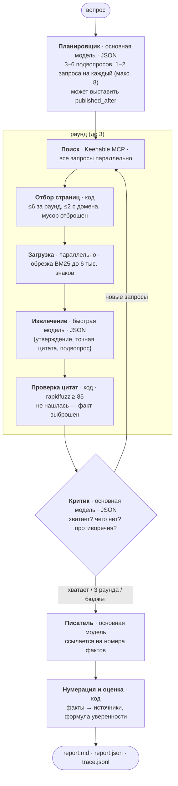

# TARO — отчёт о работе

Тестовое задание: мини-агент для глубокого исследования. Ниже — как я понял задачу, как устроена
система и почему именно так, на какие работы я опирался, что измерил, что из этого сломалось и что
делать дальше.

Все числа в отчёте воспроизводятся из `eval/results/raw.jsonl` командой `python -m eval.run_eval --report`.

---

## 1. Как я понял задачу

В формулировке есть фраза, вокруг которой строится всё остальное:

> Ответ должен быть основан на найденных источниках, а не только на знаниях модели.

Это не просьба «прикрутить поиск». Это требование, которое **нужно уметь проверять**, иначе оно
невыполнимо: языковая модель, получив страницы, с удовольствием напишет ответ, где половина
предложений — из страниц, а половина — из её собственной памяти, и внешне эти половины не отличаются.
Поэтому задачу я переформулировал так:

1. **Ответ должен быть прослеживаемым до текста страницы.** Не «модель прочитала страницу», а «вот
   строка на странице, вот предложение, которое на неё опирается».
2. **Проверять это должен не тот, кто пишет.** Если проверка — тоже вызов модели, она наследует те же
   ошибки. Значит, ключевая проверка должна быть обычным кодом.
3. **«Не нашёл» — допустимый и даже хороший ответ.** Агенту нужно явно разрешить признать пробел,
   иначе он его закроет выдумкой.
4. **Уверенность должна быть функцией доказательств, а не тона.** Если спросить модель «насколько ты
   уверена?», она отвечает про свою убеждённость, а не про то, сколько независимых источников
   подтверждают фразу. Это разные величины, и разница измерима (эксперимент E3).

Отдельно я решил, что **сравнение версий — это часть задания, а не черновики**. «Продемонстрировать
результаты» без базовой линии ничего не демонстрирует: 89 % верных ответов — это много или мало, если
не знать, что голая модель даёт 57 %, а один поиск — 79 %. Поэтому v1, v2 и v3 не удалялись по мере
развития, а остались тремя работающими режимами одной кодовой базы, с общим форматом отчёта и общей
метрикой.

### Что специально не делалось

- **Никаких агентных фреймворков** (LangChain, LlamaIndex, AutoGPT). Вся ценность здесь — в устройстве
  цикла и в проверках; фреймворк спрятал бы ровно то, что нужно показать, и добавил бы слой, который
  пришлось бы отлаживать.
- **Никакого дообучения.** Сервис даёт готовые open-source модели, 14 дней — не срок для RL-агента
  поиска. Всё держится на промптах, схемах и коде вокруг модели.

---

## 2. Устройство

### Общая схема v3



Бюджеты остановки: 3 раунда, 14 страниц, 60 фактов, 420 секунд.

### Пять решений, на которых всё держится

**1. Проверка цитат — обычный код, и цитата выбрасывается, а не чинится.**
Быстрая модель обязана вернуть точную строку со страницы. Код ищет эту строку в полном тексте
страницы нечётким сравнением (`rapidfuzz`, порог 85, минимум 15 знаков). Не нашлась — факт
выбрасывается целиком, вместе с утверждением.

Это самая дешёвая часть системы и единственная, которой можно верить безусловно: она не спрашивает
модель, она сравнивает строки. Починка («попроси модель уточнить цитату») отвергнута сознательно:
она превращает проверку в переговоры и возвращает в систему ровно тот текст, который проверку не
прошёл.

**2. Разные модели на разные роли.** Чтение страниц — это 60–70 % всех вызовов и почти весь объём
токенов, но задача там механическая: найти в тексте нужную строку. Планирование, критика и
письмо — редкие вызовы, где нужно рассуждение. Поэтому страницы читает быстрая `google/gemma4:31b`,
а планирует, критикует и пишет `openai/gpt-oss-120b`.

**3. Писатель ссылается на факты, отчёт ссылается на источники.**
Писатель видит пронумерованный список проверенных фактов и ставит `[3]` — номер факта. Код потом
переводит номера фактов в номера источников (`remap_citations`). Так писателю не нужно держать в
голове соответствие «факт → страница», а главное — **номер источника получает только та страница,
которая дала хотя бы один проверенный факт**. Нумерация происходит в самом конце.

**4. Уверенность считает код, из структуры доказательств.**

```
score(предложение) = 0.5 · min(разных сайтов, 3)/3 + 0.5 · среднее качество доменов − 0.3 · противоречие
```

- **разных сайтов**, а не ссылок: один сайт, процитированный трижды, — это не три подтверждения;
- **качество домена**: официальный 1.0 · энциклопедия 0.8 · новости 0.7 · неизвестный 0.5 ·
  блог/форум 0.4;
- **противоречие**: 1, если процитированный источник несёт факт, который критик пометил как спорный.

Пороги: 🟢 ≥ 0.75 · 🟡 ≥ 0.5 · 🔴 ниже. **Предложение без ссылки всегда 0.00 🔴 — даже если оно
верно.** Это не баг, а определение: метрика измеряет доказанность, а не правоту. Уверенность отчёта —
средняя оценка предложений, умноженная на долю подвопросов, по которым нашлись факты.

**5. Журнал событий — это и есть интерфейс.** Агент пишет каждый свой шаг в `trace.jsonl` по мере
того, как шаг происходит. Веб-страница не запускает ничего своего: сервер пересылает ей тот же поток
событий, вырезав промпты, ответы модели и локальные пути. Страница ничего не пересчитывает — даже
разбиение ответа на предложения и качество домена приходят с сервера готовыми, чтобы две реализации
никогда не разошлись и не покрасили не то предложение.

### Выбор моделей

Сервис даёт 7 open-source моделей и ничего о них не сообщает — ни размера контекста, ни поведения.
Единственный способ выбрать — прогнать их через те задачи, которые им предстоят
(`scripts/model_bench.py`, результаты в `scripts/model_bench_results.json`):

| модель | валидный JSON | цитаты реально в тексте | время на страницу | ответ по-русски | сколько текста читает |
|---|---|---|---|---|---|
| **gpt-oss-120b** | 4/4 | 13/13 | 4.4 с | хороший, замечает расхождение фактов | 31 тыс. токенов |
| **gemma4:31b** | 4/4 | 16/16 | 4.3 с | хороший, расхождение не замечает | 65 тыс. токенов |
| qwen3.8-27B | 4/4 | 16/16 | 17.8 с | хороший, замечает расхождение | 65 тыс. токенов |
| glm-4.7-flash | 0/4: сервер отдаёт ошибку на любой запрос JSON | – | ~30 с | – | 10 тыс. |
| qwen3.6-35B | не ответила ни разу (две попытки по 60 с) | – | – | – | – |

Отсюда распределение ролей из решения 2. `qwen3.8-27B` — запасной вариант: качество то же, но вчетверо
медленнее, а 12 вызовов на прогон превращают это в минуты.

### Что делает обычный код, а не модель

Стоит перечислить отдельно, потому что это и есть ответ на вопрос «чем агент отличается от промпта»:

- проверка цитат (`pages.verify_quote`),
- отбор страниц: лимит на домен, отсев мусора, дедупликация URL (`pages.select_pages`),
- обрезка страницы до релевантных пассажей по BM25 (`pages.relevant_passages`),
- разбиение ответа на предложения и разбор ссылок `[1][2]`, `[1-3]` (`taro/text.py`),
- перенумерация фактов в источники,
- формула уверенности,
- бюджеты, повторы, ограничение параллельности, кэш.

---

## 3. На каких работах это основано

Короткий список идей, которые я брал, и что именно из них взято.

- **ReAct** (Yao et al., 2022). Чередование рассуждения и действия в одном цикле. У меня цикл жёстче,
  чем в ReAct: не «модель сама решает, какой инструмент дёрнуть», а фиксированная последовательность
  план → поиск → чтение → извлечение → критика. Свобода оставлена только критику (какие запросы
  добавить и продолжать ли). Причина прагматичная: открытые модели среднего размера плохо держат
  длинный свободный ReAct-цикл, зато отлично выполняют один чётко очерченный шаг со схемой ответа.
- **Self-RAG** (Asai et al., 2023) и **CRAG / Corrective RAG** (Yan et al., 2024). Идея, что после
  извлечения нужен оценивающий шаг, который решает, годится ли найденное, и запускает исправляющее
  действие. У меня это критик: он отвечает, хватает ли фактов, какие подвопросы остались без ответа и
  какие запросы добавить. Отличие в том, что у Self-RAG оценка — это обученные reflection-токены, а
  здесь — отдельный вызов модели со схемой, потому что дообучать нечего и некогда.
- **STORM** (Shao et al., 2024). Исследование как набор разных вопросов к теме, а не один запрос;
  план пишется до текста. Отсюда планировщик с подвопросами и то, что каждый факт «приписан» к
  подвопросу — это же даёт критику язык, на котором он говорит о пробелах («подвопрос 3 не закрыт»).
  Перспективы STORM (разные роли, задающие разные вопросы) я не делал — см. раздел о развитии.
- **ALCE** (Gao et al., 2023), «Enabling LLMs to Generate Text with Citations». Главное заимствование —
  методическое: цитирование нужно мерить **по предложениям**, отдельно от правильности ответа, и
  проверять, следует ли предложение из того, на что оно ссылается. Отсюда вся конструкция судьи:
  правильность и подтверждённость цитат — два разных вопроса, задаваемых разными вызовами.
- **FreshQA / FreshLLMs** (Vu et al., 2023). Мысль, что единственный честный способ показать пользу
  поиска — вопросы о событиях после отсечки знаний модели. Отсюда 8 вопросов о 2026 годе в наборе, и
  именно они дали самый чистый результат (0/8 против 8/8).
- **FRAMES** (Krishna et al., 2024). Формат многошаговых вопросов, где ответ требует соединить факты с
  нескольких страниц. Вопросы написаны в этом стиле вручную — сам датасет не скачивался (см. раздел
  об ограничениях).
- **RAGAS** (Es et al., 2023) — как пример того, что оценку RAG принято раскладывать на отдельные оси
  (faithfulness, relevance), а не сводить к одному числу.

---

## 4. Эксперименты

**Набор вопросов** (`eval/questions.jsonl`): 28 вопросов, 19 английских и 9 русских, четырёх типов —
10 многошаговых, 8 о событиях 2026 года, 5 открытых («сравни X и Y»), 5 с ложной предпосылкой
(«почему ИСП РАН был закрыт в 2019?»). У каждого есть эталонный ответ и ключевые пункты, написанные
вручную; у свежих указана страница, по которой эталон проверялся.

**Судья** — основная модель, и ей задаются **три отдельных вопроса**, никогда не один: (а) верен ли
ответ относительно эталона, (б) следует ли каждое цитирующее предложение из тех цитат, на которые оно
ссылается, (в) насколько модель сама уверена в ответе — **без источников в промпте** (это база для
E3, и на это есть тест). Объединение этих вопросов в один вызов я пробовал: модель отвечает на
лёгкую часть и переносит вердикт на остальные.

21 решение судьи перепроверено вручную (`eval/judge_check.md`): **18 из 21 совпали**, и все три
расхождения — судья строже читателя. То есть числа ниже — нижняя оценка, а не завышенная.

Всего: 28 вопросов × {v1, v2, v3} + 12 вопросов × {1, 2 раунда} = **108 прогонов**.

### E1 — нужен ли вообще агент

| версия | n | верных | балл | предложений со ссылкой | цитаты подтверждены | ср. уверенность | с/прогон | вызовов LLM | токенов | сайтов/прогон |
|---|---|---|---|---|---|---|---|---|---|---|
| **v1** | 28 | 57 % | 0.61 | 0 % | 0 % | 0.00 | 2 | 1.0 | 409 | 0.0 |
| **v2** | 28 | 79 % | 0.82 | 72 % | 61 % | 0.47 | 5 | 1.0 | 3 186 | 7.2 |
| **v3** | 28 | 89 % | 0.91 | 84 % | 74 % | 0.53 | 57 | 12.4 | 25 858 | 5.4 |

По типам вопросов (балл: верный = 1, частичный = ½):

| тип | n | v1 | v2 | v3 |
|---|---|---|---|---|
| свежие 2026 | 8 | **0.00** (0/8) | **1.00** (8/8) | **1.00** (8/8) |
| многошаговые | 10 | 0.90 | 0.75 | 0.95 |
| открытые | 5 | 0.90 | 0.70 | 1.00 |
| ложная предпосылка | 5 | 0.70 | 0.80 | 0.60 |

Три вещи, которые эта таблица говорит:

- **Свежие вопросы — чистый результат.** 0 из 8 против 8 из 8. Это весь аргумент за retrieval в одной
  строке, и он не зависит ни от судьи, ни от формулы: модель просто не знает, кто выиграл чемпионат
  мира 2026.
- **Агент нужен на многошаговых, а не на свежих.** Один поиск закрывает свежий вопрос не хуже агента
  (обе 8/8). А вот на вопросах в два прыжка v2 проваливается ровно там, где нужен второй поиск:
  «он родился в Колумбии [2]. Источники не дают столицу этой страны». v3 на тех же вопросах — 9.5/10
  против 7.5/10.
- **Открытые вопросы v3 берёт лучше всех (5/5)**, потому что несколько раундов дают ему несколько
  точек зрения; но именно здесь качество источников хуже всего (см. причину 3 ниже).

Цена: **v3 в 30 раз дороже v2 по времени и в 8 раз по токенам** ради +10 процентных пунктов
правильности и +13 по подтверждённости цитат. Для свежего фактического вопроса это плохая сделка, для
многошагового — хорошая. Честный вывод — режим стоит выбирать по вопросу, и это готовая функция для
будущего роутера.

### Честность на вопросах с ложной предпосылкой

| версия | вопросов | сказала, что предпосылка ложная | только «не нашёл» | выдумала ответ |
|---|---|---|---|---|
| v1 | 5 | 3 | 1 | **1** |
| v2 | 5 | 4 | 1 | 0 |
| v3 | 5 | 3 | 2 | 0 |

**Ни v2, ни v3 не выдумали ничего.** Единственная выдумка за весь эксперимент — у v1: голая модель
подробно объяснила, как в 2019 году в ходе реорганизации РАН закрыли действующий институт, и
назвала двух несуществующих лауреатов премии Абеля. Это и есть цена ответа «из памяти».

При этом **v3 здесь хуже v2** — единственное место, где агент проигрывает простому RAG. Разбор в
причине 1.

### E2 — окупается ли цикл с критиком

Те же 12 вопросов (многошаговые и свежие) с бюджетом в 1, 2 и 3 раунда. Один раунд = критика нет
вообще.

| раундов разрешено | n | верных | балл | цитаты подтверждены | раундов использовано | источников | с/прогон | токенов |
|---|---|---|---|---|---|---|---|---|
| 1 | 12 | 83 % | 0.92 | 91 % | 1.0 | 4.9 | 33 | 13 775 |
| 2 | 12 | 83 % | 0.88 | 81 % | 1.2 | 6.7 | 43 | 19 109 |
| 3 | 12 | **100 %** | **1.00** | 86 % | 1.4 | 7.5 | 54 | 22 705 |

Цикл окупается: 83 % → 100 % за 1.6× токенов и 1.6× времени. Но интереснее другое: **средний прогон
использует 1.4 раунда** — критик обычно говорит «хватает» уже после первого. То есть платит за цикл
каждый вопрос, а пользу получают те немногие, которым второй раунд действительно нужен. Это довод за
адаптивный, а не фиксированный бюджет.

Второй, неприятный результат: **подтверждённость цитат при этом падает с 91 % до 86 %**. Чем больше
фактов собрано, тем длиннее и «синтетичнее» ответ, и тем чаще писатель делает шаг за пределы цитат.
Полнота и дисциплина цитирования здесь тянут в разные стороны.

### E3 — наша формула против «спросим модель»

Оба числа — про одни и те же 84 ответа. AUC — вероятность, что верному ответу досталось число выше,
чем неверному; 0.5 — монетка.

| число уверенности | ответов | среднее когда верно | среднее когда неверно | разрыв | AUC |
|---|---|---|---|---|---|
| **наша формула** | 84 | 0.41 | 0.09 | 0.32 | **0.79** |
| собственная оценка модели | 84 | 0.68 | 0.60 | 0.09 | 0.59 |

По корзинам — наша формула:

| уверенность отчёта | ответов | верных |
|---|---|---|
| 🟢 высокая | 9 | **100 %** |
| 🟡 средняя | 25 | **100 %** |
| 🔴 низкая | 50 | 58 % |

Собственная оценка модели: 54 из 84 ответов она кладёт в 🟢, и среди них 78 % верных. Она почти
ничего не разделяет — это её обычный уровень самоуверенности, а не измерение.

**Практический смысл**: 🟢 и 🟡 у нас — 34 отчёта из 34 верны. Читатель может доверять цвету. Обратное
неверно: 🔴 не значит «неправда», он значит «мы не доказали» — 58 % таких ответов верны, просто плохо
подтверждены.

Отдельно — калибровка **по предложениям** у v3 (каждое предложение каждого ответа):

| метка предложения | предложений | подтверждено судьёй |
|---|---|---|
| 🟢 | 55 | 85 % |
| 🟡 | 45 | 64 % |
| 🔴 | 54 | 35 % |

Монотонно — метка означает то, что обещает. Но 85 % у зелёного означает, что примерно одно зелёное
предложение из семи зеленее, чем заслуживает; почему — в причине 4.

### E4 — что ловит проверка цитат

| конфигурация | прогонов | цитат принято | отклонено | доля | прогонов с отклонением |
|---|---|---|---|---|---|
| v3, 1 раунд | 12 | 174 | 22 | 11 % | 8/12 |
| v3, 2 раунда | 12 | 235 | 13 | 5 % | 7/12 |
| v3, 3 раунда | 28 | 623 | 83 | 12 % | 21/28 |

Все **129 отклонённых цитат** пересчитаны относительно своей страницы (`python -m eval.quote_audit`,
результат в `eval/results/quote_audit.md`):

| чем это было на самом деле | цитат | доля |
|---|---|---|
| настоящий текст страницы, переписанный с правками | 83 | 64 % |
| пересказ или строка, собранная из таблицы | 44 | 34 % |
| короче 15 знаков | 2 | 2 % |

**Ни одна цитата не набрала меньше 50.** Это главный сюрприз всей работы: я строил проверку против
выдуманных цитат, а выдуманных цитат не оказалось вовсе. Быстрая модель не сочиняет — она
неаккуратно переписывает: склеивает два предложения через «...», разворачивает строку таблицы
`Number of Moons 0 0 1 0 2 95 274 28 16 5` в человеческую фразу, меняет тире на дефис.

Стоит ли тогда проверка своих 12 % выброшенных фактов? Да, по двум причинам. Во-первых, пересказ,
поданный как дословная цитата, — это ровно то, что читатель пойдёт проверять и не найдёт; доверие к
отчёту держится на том, что **любую** показанную строку можно найти на странице. Во-вторых, это
единственная гарантия в системе, которая не зависит от модели, и её цена — несколько миллисекунд
`rapidfuzz`. Но называть её «защитой от галлюцинаций» неправильно: она обеспечивает дисциплину
цитирования, а не ловит выдумки.

---

## 5. Что ломается

Полный разбор с примерами и номерами прогонов — в `eval/error_analysis.md`. Здесь — суть, по
причинам. У v3 три неверных ответа из 28, и это **три разных механизма**, ни один из которых не
является проблемой поиска.

### Причина 1. План наследует предпосылку вопроса (2 из 3 промахов v3)

На вопрос «как звали первого человека, ступившего на Марс в 2024 году?» планировщик пишет:

> Какая миссия 2024 года высадила первых людей на Марс?
> Кто первым ступил на марсианскую поверхность в ходе этой миссии 2024 года?

Дальше всё работает безупречно: поиск ищет несуществующую высадку, страниц с фактами нет, писатель
честно сообщает об отсутствии. Ответ правдив и совершенно бесполезен — он ни разу не говорит то,
что нужно читателю: **на Марсе никто не был**.

Ирония в том, что **v2 здесь лучше** (4 из 5 против 3 из 5). v2 показывает писателю сырые сниппеты, а
они полны фраз «ни один человек не был на Марсе». v3 фильтрует те же страницы через подвопросы — и
шаг извлечения выбрасывает ровно то предложение, которое разоблачает предпосылку, потому что оно не
отвечает ни на один подвопрос.

Это общий урок: **структурирование — это фильтр, а фильтр теряет то, чего в структуре не
предусмотрено.**

### Причина 2. Один поиск не берёт двухшаговый вопрос (только v2, 3 из 10)

«В какой стране родился автор „Ста лет одиночества“ и какая у неё столица?» → «родился в Колумбии
[2]. Источники не дают столицу этой страны.» Второй поиск стоил бы один вызов. Ради этого и
существует v3. Отдельно стоит отметить, **как** v2 проваливается: он останавливается и говорит об
этом, а не угадывает. Правила честности в промпте держатся даже там, где ответ получается неловким.

### Причина 3. Страница — контент-ферма, и этого никто не замечает

Для «сравни PostgreSQL и MySQL для аналитической нагрузки» v3 прочитал шесть страниц:
`computingforgeeks.com`, `leaper.dev`, `sivaro.in`, `tech-insider.org`, `markaicode.com`,
`oneuptime.com`. Ни одного вендора, ни одного бенчмарк-проекта, ни одной статьи. Ответ был признан
верным — и опирается на цитаты вроде «At 10M rows: PostgreSQL delivered 12,400 q/s, MySQL hit
10,800 q/s». Числа без методики, железа и даты. Проверка цитат их пропускает — текст действительно на
странице. `domain_quality` даёт всем шести 0.5 («неизвестный»), отчёт выходит 🔴 0.46 — то есть
система хотя бы не врёт о своей уверенности.

По всем прогонам v3 **99 источников из 174 — «неизвестные» домены**, официальных всего 34. Это предел
оценки качества, построенной на списке доменов: она отличает nobelprize.org от блога, но не отличает
честный малоизвестный сайт от SEO-фермы, созданной ранжироваться по этому запросу. **Проверка цитат
гарантирует, что модель не выдумала число. Она не гарантирует, что его не выдумала страница.**

### Причина 4. Писатель делает шаг за пределы цитат (главная причина 74 % вместо 85 %)

Три привычки, по убыванию частоты:

**(а) Выведенные факты носят ссылки своих слагаемых.**

> Ричард Никсон родился 9 января 1913 года [1][2][3]. Следовательно, 20 июля 1969 года ему было 56
> лет [1].

Арифметика верна, читателю это нужно, но ни одна страница не пишет «ему было 56 лет в тот день».
Предложение получает 🟢 0.83, потому что ссылается на три хороших сайта, и судья справедливо считает
его неподтверждённым. Любой вопрос вида «сколько лет / сколько прошло» порождает такое предложение —
это видно и в примере `examples/04-isp-ran-ivannikov-v3.md`.

**(б) Писатель добавляет детали, которых в цитатах нет.** Цитаты говорят «у Меркурия ноль спутников»,
а ответ объясняет это «малой массой, сильными приливными силами Солнца и очень маленькой сферой
Хилла» — сфера Хилла пришла из памяти модели и надела ссылку факта про ноль спутников.

**(в) Утверждения о литературе по одной странице.** «В текущих публикациях в качестве инструмента
бенчмаркинга упоминается только RAGAS» — на основании одной страницы про R-пакеты. Один источник не
может подтвердить утверждение о том, что говорят все источники.

### Причина 5. Число уверенности расходится с доказательствами — в обе стороны

**Завышает.** Арифметическое предложение выше: 🟢 0.83 и не подтверждено. Формула смотрит, **на что**
предложение ссылается, и никогда — **говорят ли эти источники именно это**. Это структурный зазор
между оценкой и судьёй, и именно поэтому они меряются отдельно.

**Занижает.** «Победителем Евровидения-2026 объявлена DARA», подтверждено eurovision.com и
пресс-релизом EBU — и оценка 🔴 0.49, потому что сайтов один, а `min(сайтов,3)/3` даёт одному сайту
треть. Формула не умеет сказать «источник один, но это **тот самый** источник».

**Налог на честность.** 25 из 156 предложений v3 не имеют ссылок, и **12 из них — это признания, что
источники не ответили на подвопрос**. Каждое получает 0.00 🔴 и тянет средний балл отчёта вниз. Агент
наказывается за признание пробела ровно так же, как за необоснованное утверждение — прямо
противоположно тому, ради чего проект делался. Два ответа на вопросы с ложной предпосылкой получили
итоговые 0.00 за текст, целиком состоящий из честных признаний.

---

## 6. Ограничения

Что я знаю про границы применимости этих результатов.

**Измерение**

- **28 вопросов — мало.** Разница в 1–2 ответа сдвигает проценты на 4–7 пунктов. Числа стоит читать
  как порядок величины и как направление, а не как точную оценку.
- **Судья — модель того же семейства, что и писатель.** Ручная проверка 21 решения (18 совпадений, все
  расхождения — в сторону строгости) говорит, что таблицы осмысленны, но независимый судья — это то,
  что здесь по-настоящему нужно и чего нет.
- **Эталонные ответы писал тот же человек, который строил систему.** Многошаговые вопросы написаны в
  стиле FRAMES, а не взяты из датасета: сам датасет сюда не поставляется, и скачивание его не стоило
  ещё одной сетевой зависимости. Для свежих вопросов эталон проверен по конкретной странице, ссылка
  сохранена.
- **Веб меняется.** Прогон через месяц даст другие источники и, возможно, другие ответы.
  Воспроизводимость обеспечена кэшем и сохранёнными прогонами, а не стабильностью интернета.

**Система**

- Максимум 3 раунда, 14 страниц, 60 фактов, 420 секунд. Бюджет времени проверяется **между** раундами,
  так что один медленный раунд может его превысить.
- Качество домена — фиксированный список категорий, а не оценка (причина 3).
- Формат вопроса — один текстовый запрос. Уточняющих вопросов пользователю агент не задаёт: на
  «сравни X и Y» он сам решает, по каким осям сравнивать.
- Источники — только веб через Keenable. Ни PDF-корпусов, ни научных баз, ни локальных документов.
- Штраф за противоречие — **на источник, а не на предложение**: предложение теряет 0.3, если любой из
  процитированных источников несёт спорный факт, пусть и совсем о другом.
- Сервер не ограничивает число одновременных прогонов, остановка прогона в браузере отменяет задачу,
  но уже отправленный вызов модели всё равно завершится.
- Веб-страницу **не смотрел человек**: она проверена headless-тестами (десять проверок), визуальная
  проверка и проверка на ширине телефона остаются открытыми.

---

## 7. Что делать дальше

По убыванию отношения «польза / работа», и каждый пункт привязан к измеренной выше проблеме.

**1. Шаг проверки предпосылки (причина 1, 2 из 3 промахов).**
Разрешить планировщику один подвопрос вида «верна ли предпосылка вопроса вообще?» и — отдельно —
отдавать писателю топ сниппетов даже тогда, когда фактов извлечь не удалось. Второе почти бесплатно
и возвращает v3 то преимущество, которое сейчас есть у v2. Самое дешёвое улучшение из списка.

**2. Отдельный верификатор ответа (причины 4 и 5).**
Сейчас никто не проверяет готовый текст: цитаты проверяются на входе, ответ — нет. Нужен шаг, который
берёт написанное предложение и его цитаты и отвечает «следует / не следует» — то же самое, что делает
судья в оценке, только внутри цикла, с правом отправить предложение на переписывание. Это закрывает
структурный зазор из причины 5 напрямую: оценка перестанет быть функцией только от того, **на что**
сослались.

**3. Отметка «выведено» (причина 4а).**
Дать писателю право помечать предложение как выведенное из фактов, а не утверждаемое ими, и считать
его уверенность от фактов-слагаемых. Это чинит и метрику, и честность текста: «56 лет» — вывод
системы, а не цитата, и читателю полезно это видеть.

**4. Починить формулу в трёх местах (причина 5).**
Исключить предложения-признания «не нашли» из среднего, учитывая их в члене покрытия; дать
официальному первоисточнику вес больше, чем «один сайт»; сделать штраф за противоречие
пер-предложенческим, а не пер-источниковым.

**5. Критик оценивает источники, а не только покрытие (причина 3).**
Спрашивать не только «чего не хватает», но и «сослались бы вы на эту страницу в отчёте?». Плюс
простое правило, которое не требует модели: предпочитать факт, который независимо подтверждают
несколько доменов, факту с одной страницы.

**6. Реранкер вместо BM25 + эвристик отбора.**
Отбор страниц сейчас — правила (лимит на домен, отсев мусора), а обрезка — BM25. Кросс-энкодер
(bge-reranker и подобные) на паре «подвопрос — пассаж» выбирал бы, что читать и что показывать
экстрактору, заметно точнее. Это прямо бьёт по причине 3: ферма редко релевантна подвопросу так же
хорошо, как первоисточник.

**7. Перспективы в духе STORM (открытые вопросы).**
На «сравни X и Y» порождать несколько ролей с разными интересами (эксплуатация, стоимость,
надёжность) и задавать вопросы от каждой. Это даёт тот охват, который сейчас получается случайно, из
нескольких раундов.

**8. Уточняющий вопрос пользователю.**
Если планировщик видит, что вопрос допускает несколько прочтений, дешевле спросить один раз, чем
исследовать не то. Интерфейс для этого уже есть — поток событий двусторонний по конструкции.

**9. Роутер режимов.**
E1 показал, что для свежего фактического вопроса v2 не хуже v3 и в 30 раз быстрее. Классификатор
вопроса (один прыжок или несколько) экономил бы большую часть стоимости без потери качества.

**10. Обученный агент поиска (долгая ветка).**
Всё выше — это промпты и код вокруг модели. Следующий уровень — обучать саму политику поиска на
сигнале «привёл ли этот запрос к факту, который дожил до ответа» (линия Search-R1 и подобных работ).
Данные для этого у системы уже есть: каждый `trace.jsonl` — это размеченная траектория, где видно,
какой запрос какой факт породил и какие факты дошли до финального текста. Требует времени и
инфраструктуры, которых у тестового задания нет, но накопление траекторий начинается само собой.

---

## 8. Итог

Работающая система из трёх режимов, где каждый следующий измеримо лучше предыдущего на тех вопросах,
ради которых он сделан: v3 даёт 89 % верных ответов против 57 % у голой модели, 84 % предложений
несут ссылку, и 🟢/🟡-отчёты верны в 34 случаях из 34.

Два результата, которых я не ожидал и которые считаю более ценными, чем сами проценты:

- **Выдуманных цитат не существует.** Все 129 отклонённых оказались реальным текстом страницы,
  переписанным неаккуратно. Защита строилась не от той угрозы; настоящая угроза — не выдуманная
  цитата, а **настоящая цитата с плохой страницы** (причина 3) и **верное предложение, которое не
  говорит ни один источник** (причина 4).
- **Структура — это фильтр, и фильтр теряет неожиданное.** v3 проигрывает простому v2 на вопросах с
  ложной предпосылкой именно потому, что аккуратно раскладывает вопрос на подвопросы и выбрасывает
  всё, что на них не отвечает — включая ту единственную фразу, которая разоблачает вопрос.

И то и другое — аргументы за пункты 1 и 2 в списке развития, и оба видны только потому, что версии
измерялись друг против друга, а не оценивались по отдельности.
